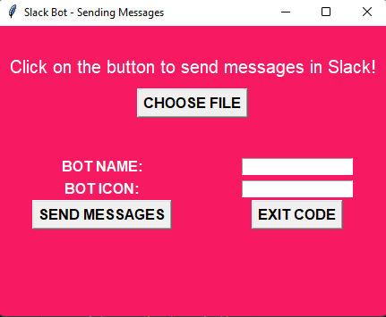

# Slack Bot

## About

    This was a project that I developed using Python with Slack's API to send hundreds of direct messages to different users on Slack on a single click. 

    <a href="#features">Features</a> •
    <a href="#tech">Tech Stack</a> •
    <a href="#deploy">Deploy</a> •
    <a href="#author">Author</a>

### Features
- [x] Desktop layout 
- [x] Made only with pure Javascript, without using libraries like jquery, lodash, etc. 

### Tech Stack
Languages: 

### Deploy

The application layout is: 

### Author
---

 
  
   
  
  
  

